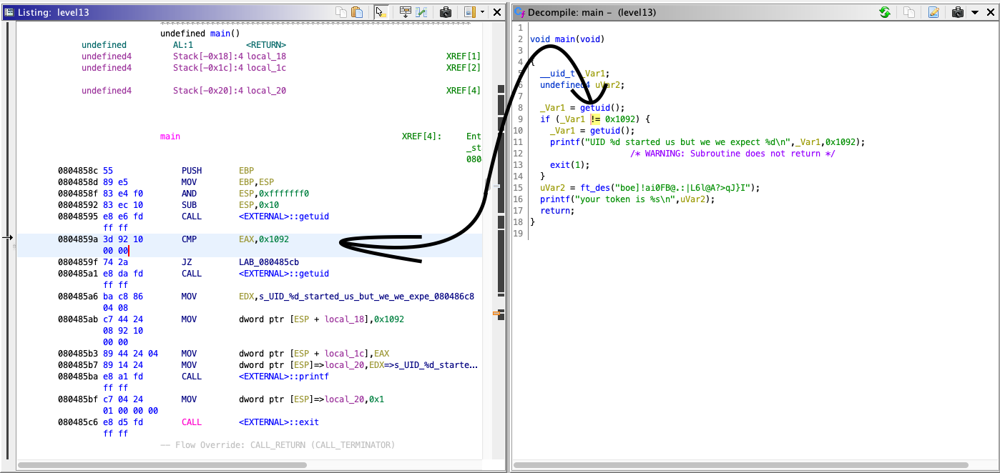
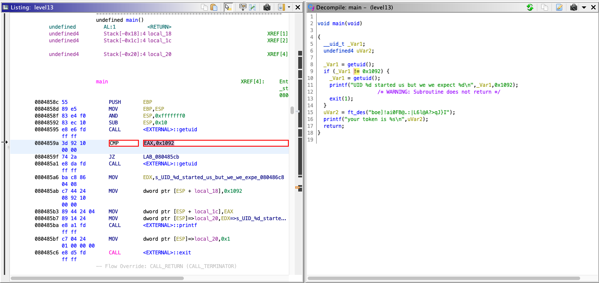
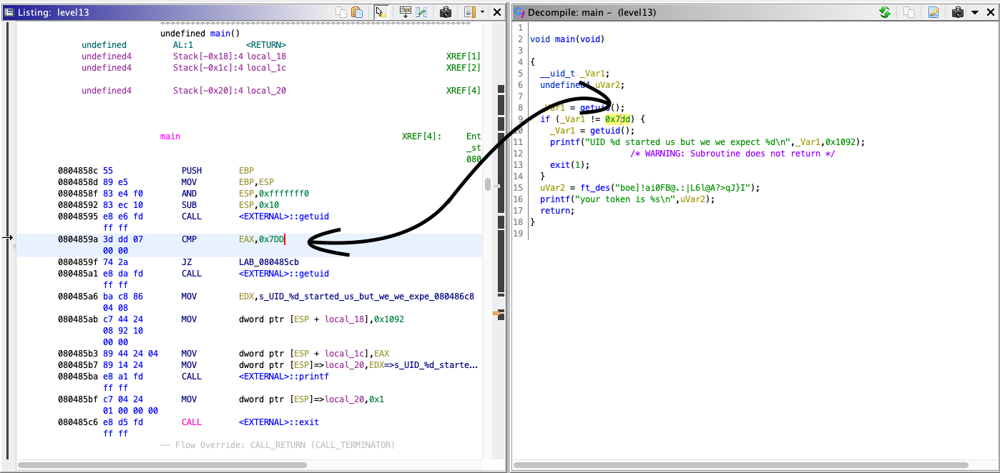
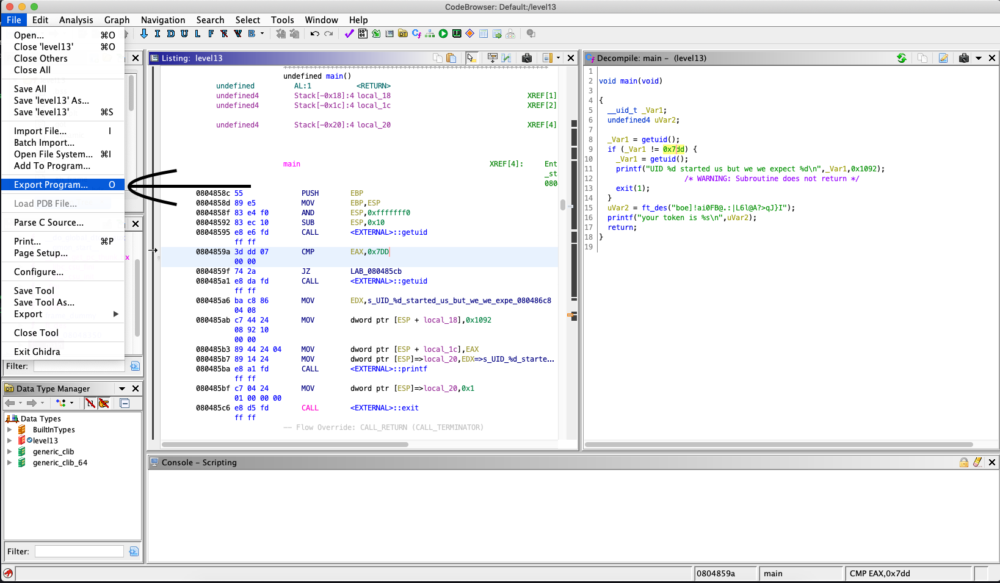
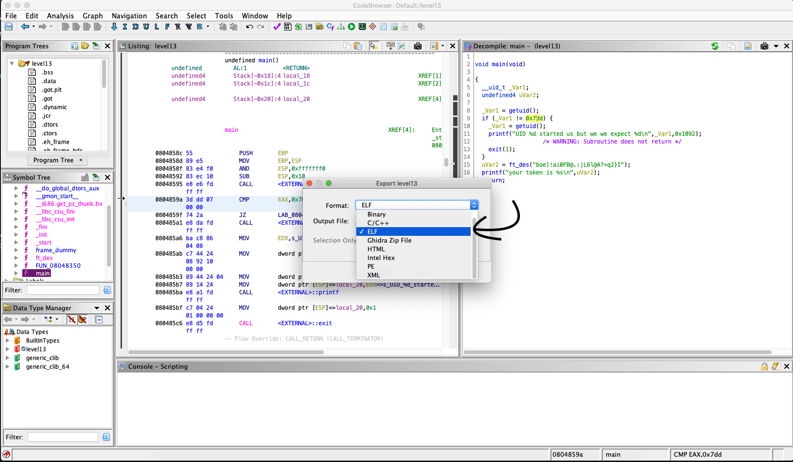

# Level13 Writeup
 
## Info
 
User level13 has a setuid (flag13) ELF binary `level13` in the root of their home directory. Attempting to run this file shows us a message stating we don't have the uid 4242.
 
Using Ghidra, we can get a better look at what the program is doing. There are two functions that seem interesting , main and ft_des.
 
`level13`:main
``` c
void main(void) {
 __uid_t _Var1;
 undefined4 uVar2;
  _Var1 = getuid();
 if (_Var1 != 0x1092) {
   _Var1 = getuid();
   printf("UID %d started us but we we expect %d\n",_Var1,0x1092);
   exit(1);
 }
 uVar2 = ft_des("boe]!ai0FB@.:|L6l@A?>qJ}I");
 printf("your token is %s\n",uVar2);
 return;
}
```
 
`level13`:ft_des
``` c
 
char * ft_des(char *param_1) {
 char cVar1;
 char *pcVar2;
 uint uVar3;
 char *pcVar4;
 byte bVar5;
 uint local_20;
 int local_1c;
 int local_18;
 int local_14;
  bVar5 = 0;
 pcVar2 = strdup(param_1);
 local_1c = 0;
 local_20 = 0;
 do {
   uVar3 = 0xffffffff;
   pcVar4 = pcVar2;
   do {
     if (uVar3 == 0) break;
     uVar3 = uVar3 - 1;
     cVar1 = *pcVar4;
     pcVar4 = pcVar4 + (uint)bVar5 * -2 + 1;
   } while (cVar1 != '\0');
   if (~uVar3 - 1 <= local_20) {
     return pcVar2;
   }
   if (local_1c == 6) {
     local_1c = 0;
   }
   if ((local_20 & 1) == 0) {
     if ((local_20 & 1) == 0) {
       for (local_14 = 0; local_14 < "0123456"[local_1c]; local_14 = local_14 + 1) {
         pcVar2[local_20] = pcVar2[local_20] + -1;
         if (pcVar2[local_20] == '\x1f') {
           pcVar2[local_20] = '~';
         }
       }
     }
   }
   else {
     for (local_18 = 0; local_18 < "0123456"[local_1c]; local_18 = local_18 + 1) {
       pcVar2[local_20] = pcVar2[local_20] + '\x01';
       if (pcVar2[local_20] == '\x7f') {
         pcVar2[local_20] = ' ';
       }
     }
   }
   local_20 = local_20 + 1;
   local_1c = local_1c + 1;
 } while( true );
}
 
 
```
 
ft_des looks like hell to reverse, and since there are no checks for uuid in it, I'll focus the attack on main.
 
## Ghidra Magic
 
We can simply patch the executable at the point where the check is made for the uuid
 
First we need to find where in assembly we need to perform the patch, Select the comparison and an assembly block should light up. It should be a CMP instruction.

 
Then we can edit this CMP instruction, by pressing on CMD + SHIFT + G (Mac) or CTRL + SHIFT + G (Windows/Linux), edit the hexadecimal value to be equal to your uid


 
Then simply export the program, make sure you save the file as an ELF binary


 
Run the program and BOOM, you have the flag!
 

